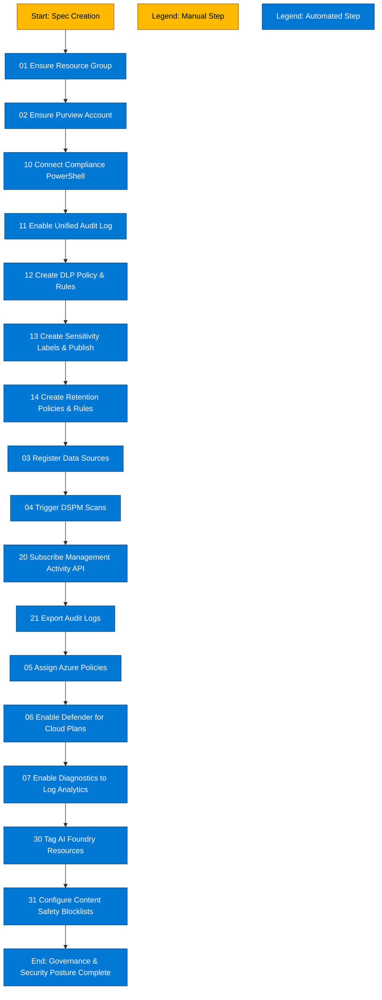

# DSPM + AI Governance Automation (Spec-Driven)

This repository contains **atomic PowerShell scripts** for automating Microsoft Purview DSPM, Defender for AI posture, and Azure AI Foundry governance. Each script is **idempotent**, **spec-driven**, and can be run independently or orchestrated via pipelines.

---

## ✅ What’s Included
- **Spec Template** (`spec.dspm.json`) capturing:
  - Azure context (tenant, subscription, RG, Purview account)
  - Data sources & scans
  - DLP policies, sensitivity labels, retention rules
  - Audit export settings
  - Defender for AI plans, diagnostics, Azure Policies
  - AI Foundry resources & Content Safety blocklists

- **Atomic Scripts**:
  - `00-New-DspmSpec.ps1` – Scaffold spec
  - `01-Ensure-ResourceGroup.ps1` – Create RG
  - `02-Ensure-PurviewAccount.ps1` – Create Purview account
  - `03-Register-DataSource.ps1` – Register data sources
  - `04-Run-Scan.ps1` – Trigger scans
  - `10-Connect-Compliance.ps1` – Connect to IPPS
  - `11-Enable-UnifiedAudit.ps1` – Enable Unified Audit Log
  - `12-Create-DlpPolicy.ps1` – Create DLP policy & rules
  - `13-Create-SensitivityLabel.ps1` – Create labels & publish
  - `14-Create-RetentionPolicy.ps1` – Create retention policies
  - `20-Subscribe-ManagementActivity.ps1` – Start audit subscriptions
  - `21-Export-Audit.ps1` – Export audit logs
  - `05-Assign-AzurePolicies.ps1` – Assign built-in Azure Policies
  - `06-Enable-DefenderPlans.ps1` – Enable Defender for Cloud plans
  - `07-Enable-Diagnostics.ps1` – Configure diagnostics to Log Analytics
  - `30-Foundry-RegisterResources.ps1` – Tag AI Foundry resources
  - `31-Foundry-ConfigureContentSafety.ps1` – Configure Content Safety blocklists

---

## ✅ Order of Operations Diagram


## Script Inventory (Atomic Modules)

Tags enable the feature‑flag behavior in run.ps1.
Use them to run subsets like dspm, defender, foundry, scans, audit, policies, networking, ops.
| **Script** | **Step / Purpose** | **DSPM for AI Relation (Purview)** | **Primary Tags** | **Requires Spec?** |
|------------|----------------------|-------------------------------------|-------------------|----------------------|
| `00-New-DspmSpec.ps1` | Scaffold a JSON spec template | Input contract for all automation | `ops` | No |
| `01-Ensure-ResourceGroup.ps1` | Ensure Azure RG exists | Foundation for Purview account | `foundation`, `dspm` | Yes |
| `02-Ensure-PurviewAccount.ps1` | Ensure Purview (governance) account | Required for DSPM scans & insights | `foundation`, `dspm` | Yes |
| `03-Register-DataSource.ps1` | Register data sources in Purview | DSPM **Discovery** | `scans`, `dspm` | Yes |
| `04-Run-Scan.ps1` | Create & trigger scans | DSPM **Classification/Scan** | `scans`, `dspm` | Yes |
| `05-Assign-AzurePolicies.ps1` | Assign built‑in Azure Policies | Prevent misconfigurations that leak AI data | `policies`, `dspm`, `defender` | Yes |
| `06-Enable-DefenderPlans.ps1` | Enable Defender for Cloud plans | Telemetry & protections for AI resources | `defender` | Yes |
| `07-Enable-Diagnostics.ps1` | Route diagnostics to Log Analytics | Monitoring trail supporting DSPM analytics | `defender`, `diagnostics`, `foundry` | Yes |
| `08-Ensure-PrivateEndpoints.ps1` | Create Private Endpoints | Data egress control for AI data paths | `networking`, `dspm`, `foundry` | Yes |
| `09-Ensure-KeyVaultSecrets.ps1` | Ensure secrets in Key Vault | Secures keys used by Content Safety | `ops`, `foundry` | Yes |
| `10-Connect-Compliance.ps1` | Open IPPS (Compliance PowerShell) | Required session for governance cmdlets | `compliance`, `dspm` | No |
| `11-Enable-UnifiedAudit.ps1` | Enable Unified Audit ingestion | Backbone for Activity Explorer & DSPM | `audit`, `dspm`, `compliance` | No |
| `12-Create-DlpPolicy.ps1` | Create DLP policy & rules | Prevent high‑risk exfiltration | `policies`, `dspm` | Yes |
| `13-Create-SensitivityLabel.ps1` | Create labels & publish | Classification/Protection pillar | `policies`, `dspm` | Yes |
| `14-Create-RetentionPolicy.ps1` | Create retention policies & rules | Lifecycle management for AI data | `policies`, `dspm` | Yes |
| `15-Create-SensitiveInfoType-Stub.ps1` | Stub for custom SITs | Extend detection (future/portal) | `policies`, `dspm` | No |
| `16-Create-TrainableClassifier-Stub.ps1` | Stub for classifiers | Trainable ML detection (portal) | `policies`, `dspm` | No |
| `17-Export-ComplianceInventory.ps1` | Export labels/DLP/retention inventory | Evidence & documentation | `ops`, `dspm` | No |
| `18-Set-CompliancePermissions.ps1` | Add user to Compliance role group | Grants governance authoring rights | `ops`, `compliance`, `dspm` | No |
| `19-Ensure-ActivityContentTypes.ps1` | (Re)subscribe audit content types | Ensures correct audit feeds | `audit`, `dspm` | Yes |
| `20-Subscribe-ManagementActivity.ps1` | Start Management Activity API subscriptions | Feeds audit stream | `audit`, `dspm` | Yes |
| `21-Export-Audit.ps1` | Export audit (JSON/CSV) | Data for DSPM analytics | `audit`, `dspm` | Yes |
| `22-Ship-AuditToStorage.ps1` | Upload audit files to ADLS Gen2 | Long‑term evidence / Fabric ingestion | `audit`, `ops` | No |
| `23-Ship-AuditToFabricLakehouse-Stub.ps1` | Stub to land audit in Fabric | Build dashboards for AI governance | `audit`, `foundry` | No |
| `24-Create-BudgetAlert-Stub.ps1` | Stub for budget/alerts | Guardrails for PAYG usage | `ops` | No |
| `25-Tag-ResourcesFromSpec.ps1` | Apply tags from spec | Posture metadata for AI assets | `ops`, `foundry`, `dspm` | Yes |
| `26-Register-OneLake.ps1` | Register OneLake root as data source | DSPM Discovery for Fabric | `scans`, `dspm`, `foundry` | Yes |
| `27-Register-FabricWorkspace.ps1` | Register a specific Fabric workspace | Targeted DSPM scanning | `scans`, `dspm`, `foundry` | Yes |
| `28-Trigger-OneLakeScan.ps1` | Trigger scan for OneLake | DSPM Classification/Scan | `scans`, `dspm`, `foundry` | Yes |
| `29-Trigger-FabricWorkspaceScan.ps1` | Trigger scan for workspace | DSPM Classification/Scan | `scans`, `dspm`, `foundry` | Yes |
| `30-Foundry-RegisterResources.ps1` | Validate & tag Foundry resources | Governance metadata for AI | `foundry`, `ops` | Yes |
| `31-Foundry-ConfigureContentSafety.ps1` | Configure Content Safety blocklists | Prompt filtering guardrails | `foundry`, `defender` | Yes |
| `32-Foundry-GenerateBindings-Stub.ps1` | Stub for AOAI/AI Search bindings | App‑side wiring to governed services | `foundry` | No |
| `33-Compliance-Report.ps1` | Quick compliance summary | “Are we protected?” snapshot | `ops`, `dspm` | No |
| `34-Validate-Posture.ps1` | Validations (audit enabled, plans) | Sanity checks of posture | `ops`, `dspm`, `defender` | Yes |

## How to Run 
```powershell
# 1) Create a spec template
./00-New-DspmSpec.ps1 -OutFile ./spec.dspm.json

# 2) Provision Azure side
./01-Ensure-ResourceGroup.ps1 -SpecPath ./spec.dspm.json
./02-Ensure-PurviewAccount.ps1  -SpecPath ./spec.dspm.json

# 3) Compliance backbone
./10-Connect-Compliance.ps1
./11-Enable-UnifiedAudit.ps1

# 4) Governance policies
./12-Create-DlpPolicy.ps1 -SpecPath ./spec.dspm.json
./13-Create-SensitivityLabel.ps1 -SpecPath ./spec.dspm.json
./14-Create-RetentionPolicy.ps1 -SpecPath ./spec.dspm.json

# 5) DSPM scans
./03-Register-DataSource.ps1 -SpecPath ./spec.dspm.json
./04-Run-Scan.ps1 -SpecPath ./spec.dspm.json

# 6) Audit & monitoring
./20-Subscribe-ManagementActivity.ps1 -SpecPath ./spec.dspm.json
./21-Export-Audit.ps1 -SpecPath ./spec.dspm.json

# 7) AI security posture
./05-Assign-AzurePolicies.ps1 -SpecPath ./spec.dspm.json
./06-Enable-DefenderPlans.ps1 -SpecPath ./spec.dspm.json
./07-Enable-Diagnostics.ps1 -SpecPath ./spec.dspm.json

# 8) AI Foundry governance
./30-Foundry-RegisterResources.ps1 -SpecPath ./spec.dspm.json
./31-Foundry-ConfigureContentSafety.ps1 -SpecPath ./spec.dspm.json
```

